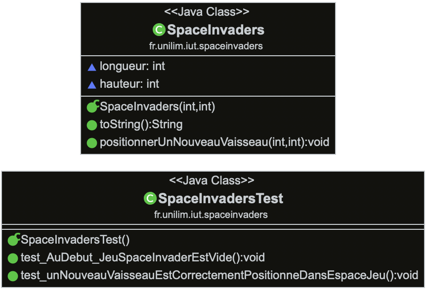
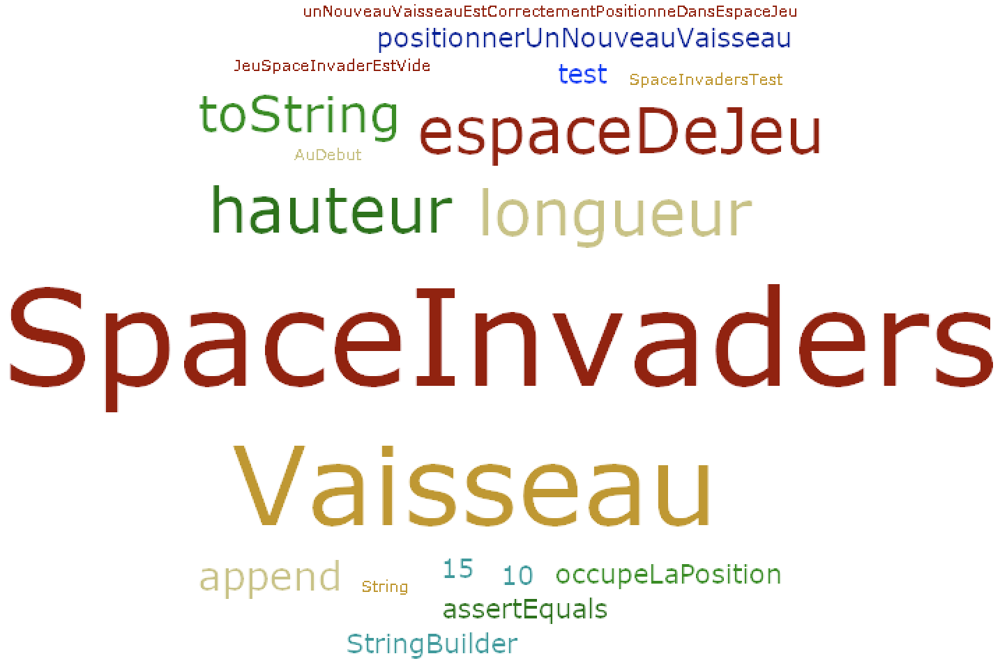
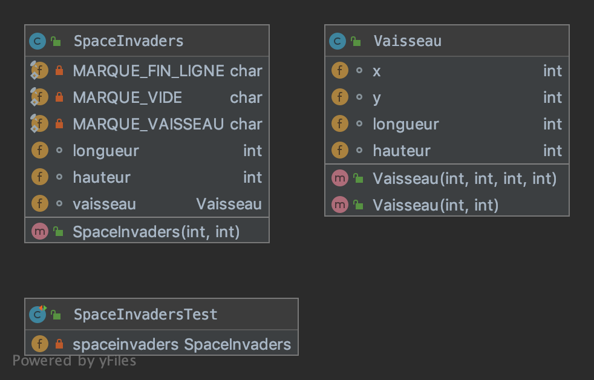
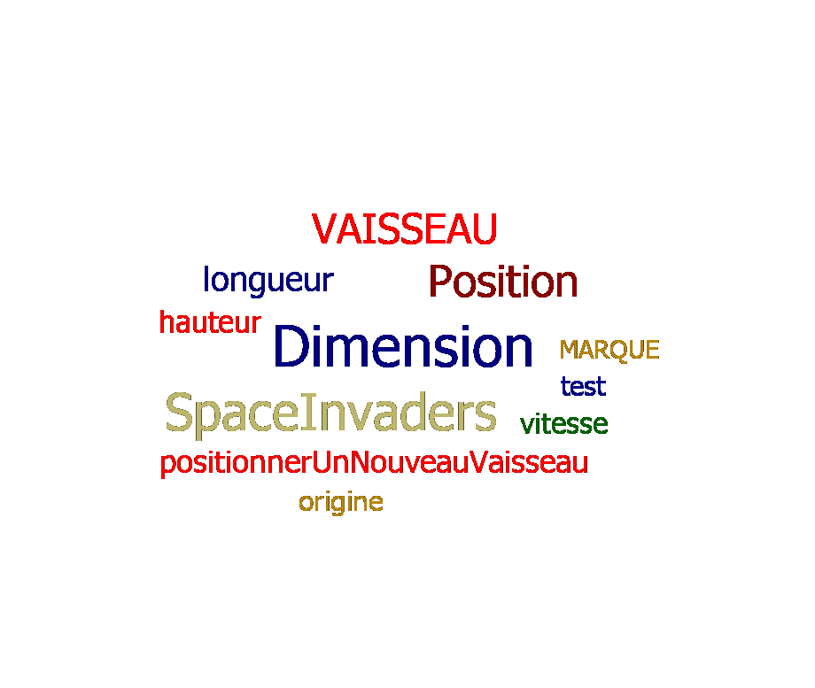
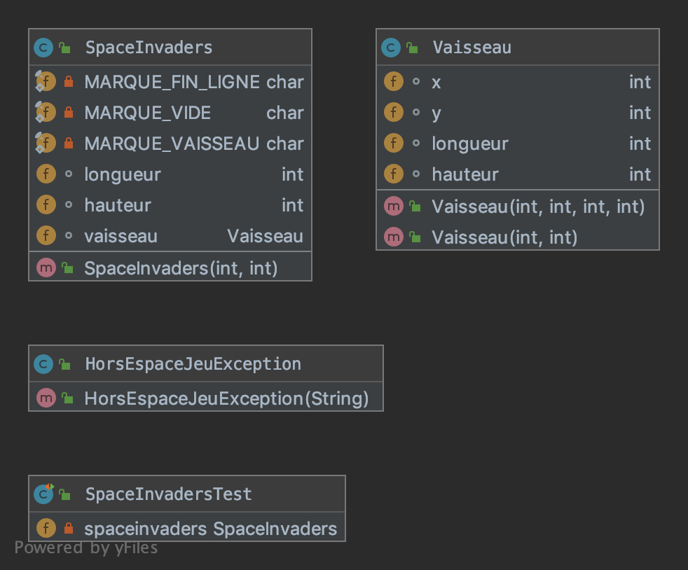
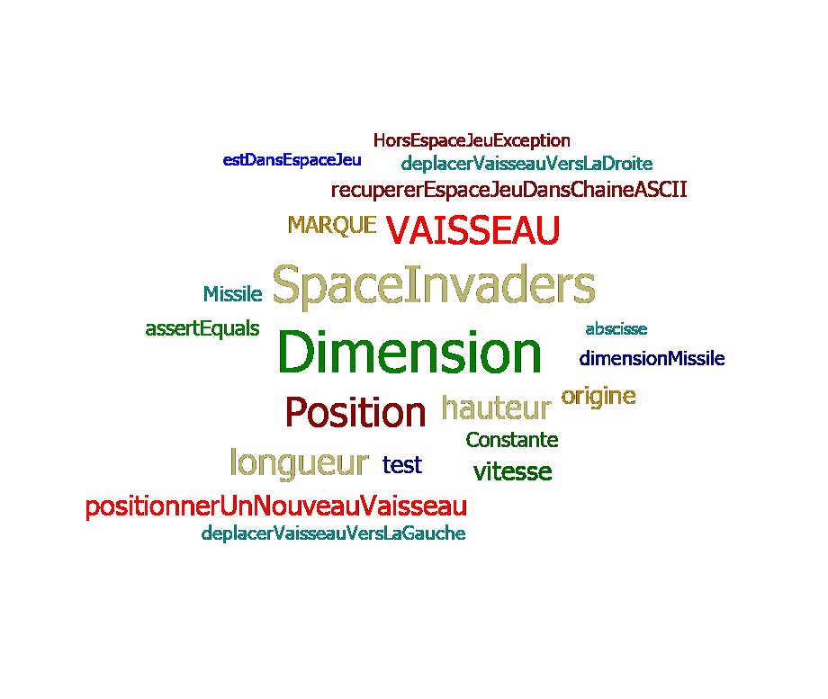
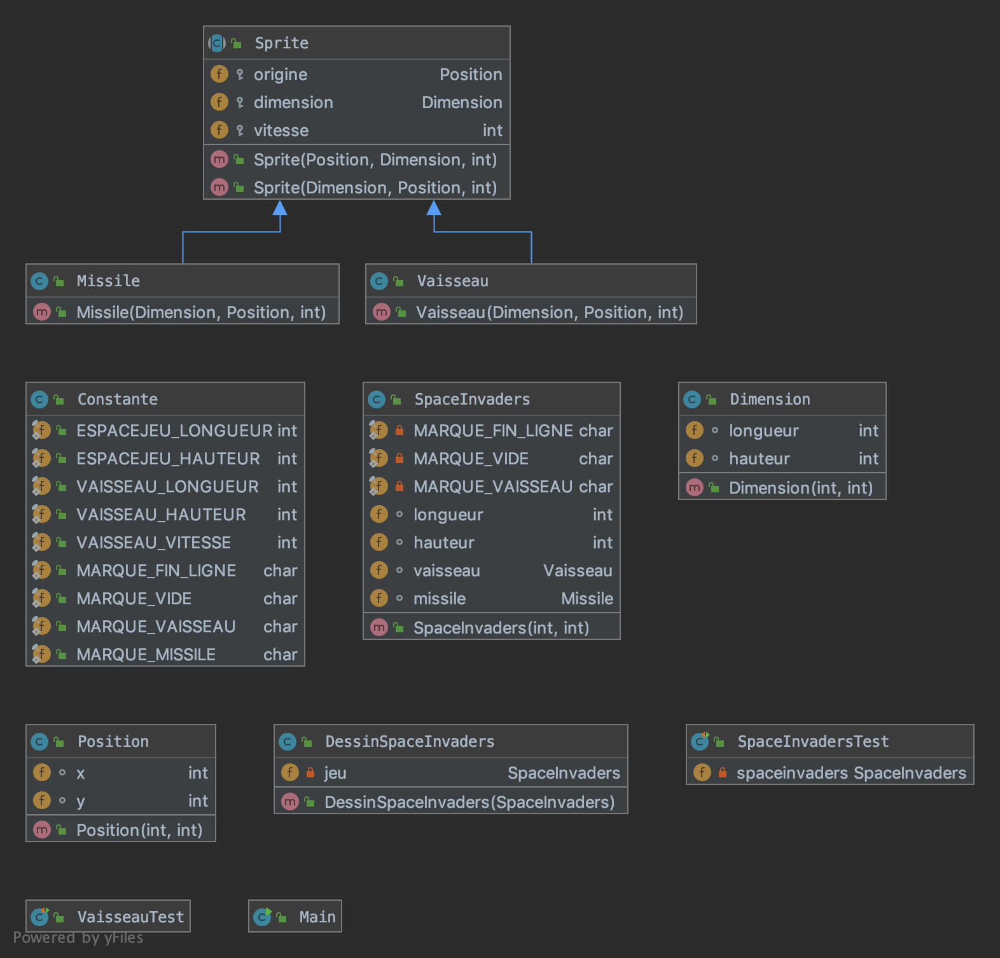
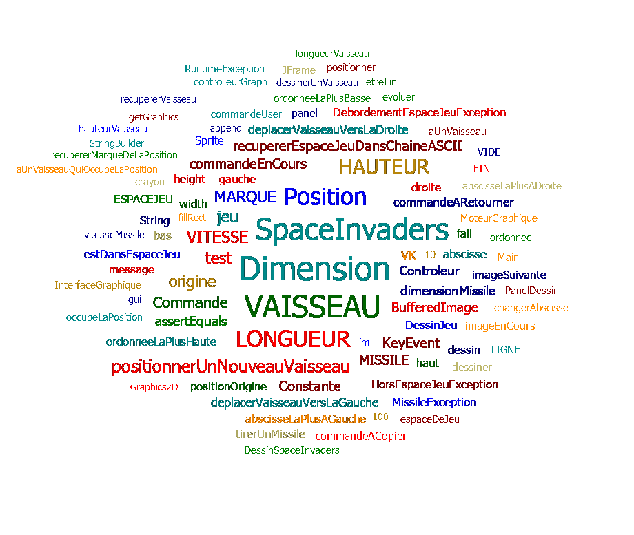

README.md
# Semaine du 29 avril au 5 mai

# Description du travail effectué 

Fonctionnalité n°1 : Déplacer un vaisseau dans l'espace de jeu (fini)

Story n°1 : Créer un espace de jeu : 
Un espace de jeu est créé aux dimensions données (2D) 
Cet espace de jeu est vide

Story n°2 : Positionner un nouveau vaisseau dans l’espace de jeu : 
Un nouveau vaisseau est créé

# Diagramme de classes

# Nuage de mots 

---

# Semaine du 13 mai au 19 mai

# Description du travail effectué 

Story n°3 : Déplacer le vaisseau vers la droite dans l'espace de jeu

Story n°4 : Déplacer le vaisseau vers la gauche dans l'espace de jeu

Vérification de la couverture du code à l'aide de IntelliJ.

# Diagramme de classes

# Nuage de mots 

---

# Semaine du 20 mai au 26 mai

# Description du travail effectué 

Fonctionnalité n°2 : Dimensionner le vaiseau 

Etape n°1 : Positionner un nouveau vaisseau avec une dimension donnée

# Diagramme de classes

# Nuage de mots 

---

# Semaine du 27 mai au 2 juin

Fonctionnalité n°3 : Choisir la vitesse du vaisseau

Implémentation de l'interface graphique

Fonctionnalité n°4 : Tirer un missile depuis le vaisseau

# Description du travail effectué 

Fonctionnalité n°2 : Dimensionner le vaiseau 

Etape n°1 : Positionner un nouveau vaisseau avec une dimension donnée

# Diagramme de classes

# Nuage de mots 

